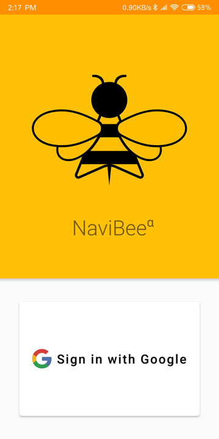
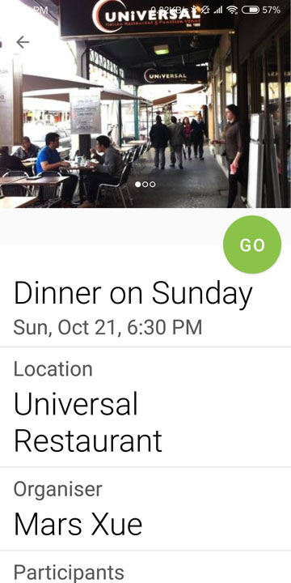
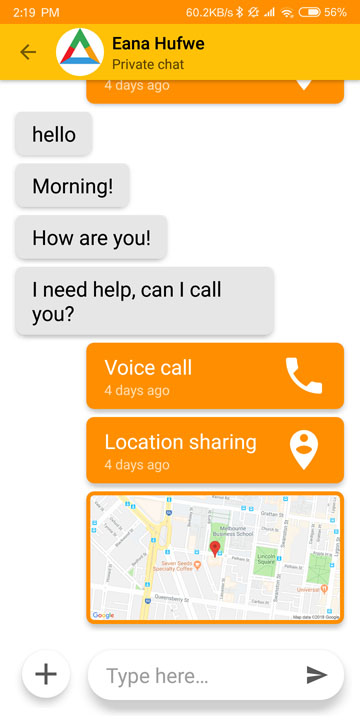

# NaviBee
[](https://github.com/COMP30022-18/NaviBee/blob/master/LICENSE)


[description]
NaviBee is a Location-based Android smartphone app project designed for elderly people.

The app is special designed for helping elderly people to reach their destination by providing sufficient help and easily understanding UI.
One-to-one and One-to-many communication using rich media(text, image, voice call, location and real-time location) is also provided for elderly people as extra help.
The function of Events and SOS are provided to users for social activities and emergency situation.  


### Screenshot
<table border="0">
 <tr>
    <td></td>
    <td></td>
    <td></td>
    <td></td>
    <td></td>
 </tr>
 <tr>
    <td></td>
    <td></td>
    <td></td>
    <td></td>
    <td></td>
 </tr>
</table>

### Key features
[key features]
1. Navigation
2. Text/Voice/Image Communication
3. Real-time Location share
4. Group Events share
5. Emergency Detection


## Technical details

### Folder Structure
```js
/
├── Android/    // Android project root
│   ├── app/src/main/java/au/edu/unimelb/eng/navibee/
│   │           // Main code
│   └── app/src/test/java/au/edu/unimelb/eng/navibee/
│               // Unit test
├── Backend/
|               // Code for Firebase Cloud Function
└── Tool/
                // Code for migrating db during development
```

### Setup
NaviBee uses multiple online services and please follow the instruction below in order to build your own version.

#### Firebase
1. Register [here](https://firebase.google.com/) and create a new project.
2. Enable Google Sign-in provider in Authentication.
3. Upload code in `\Backend\` to Firebase Cloud Function following [this guide](https://firebase.google.com/docs/functions/get-started).
4. Open the NaviBee Android project using Android Studio and connect it to the Firebase project following [this guide](https://firebase.google.com/docs/android/setup).

#### Agora
1. Register [here](https://www.agora.io/en/) and add the AppId to your `gradle.properties` like `agoraAppId=f******4`

#### Google Maps SDK
1. Follow the instructions [here](gmsdk) to obtain the key.
2. Add the key to your `gradle.properties` like `googlePlacesApiKey=5L+h44GY44Gf4-4KC44Gu44Gv6YO95ZCI44Gu44`

#### Mapbox
1. Obtain your API Token [here](mapbox).
2. Add the key to your `gradle.properties` like `mapboxApiToken=pk.GE44GE5aaE5oOz44KS57mw44KK6L+U44GX5pig44GX5Ye644GZ6Y+h5a6I44Gj4.4Gf44KC44Gu44Gv5p_iO44`

#### Here Maps
1. Obtain your application credentials [here](heremap).
2. Add the keys to your `gradle.properties` like:
    ```
    hereAppId=KL44GE5pyq5p2l5bm75o
    hereAppCode=Oz44KS6KaL44Gb44Gq44GM
    hereLicenseKey=44KJ5raI44GI44Gm44KG44GP5YWJ5peF44Gu57WC44KP44KK44Gu5aSi44Gr6KaL44Gf5a2Y5Zyo44Gr5YOV44Gv44Gq44KM44G+44GZ44KI44GG44Gr44Gq44KM44G+44GZ44KI44GG44Gr44Kq44Ov44Op44OK44Kk44Km44K/44Oy44Km44K/44Kq44Km44Oc44Kv44Ks44Kq44Ov44OD44OG44K344Oe44Km44Oe44Ko44OL57a044Gj44Gm6YCj44Gt44Gm56eB44GM44GC44Gf44GX44GM44Gd44Gu5oCd5oOz44KS5Y+r44G244GL44KJ5o+P44GE44Gm55CG5oOz44KS44Gd44Gu5oCd44GE44Gv6Kqw44Gr44KC6Kem44KM44GV44Gb44Gq44GE6IG044GT44GI44KL44GT44Gu5aOw44GC44Gf44GX44GM44Gd44Gu6Kq56KyX44KS5o6744GN44GR44GZ44GL44KJ44KP44GL44Gj44Gm44KL5pys5b2T44Gv5ZCb44GM6Kqw44KI44KK5YSq44GX44GE44Gj44Gm44GT44Go44KS5LqM5Lq644Gv44Gp44KT44Gq44Gr44Gf44GP44GV44KT44Gu6KiA6JGJ44KS5oCd44GE44Gk44GE44Gf44GT44Go44Gg44KN44GG44G=
    ```

[gmsdk]: https://developers.google.com/places/android-sdk/signup
[mapbox]: https://www.mapbox.com/account/access-tokens
[heremap]: https://developer.here.com/documentation/android-premium/dev_guide/topics/credentials.html
